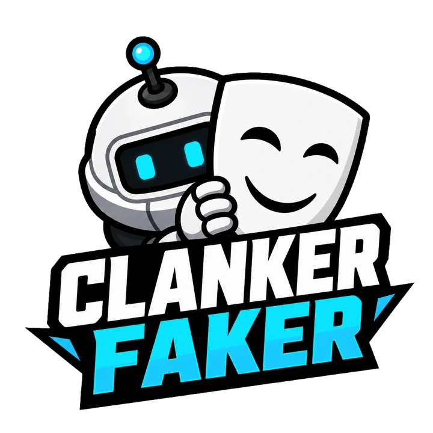

<p align="center">
  
</p>

<p align="center">
  <strong>One of these clankers is human. Can you spot them?</strong>
</p>

<p align="center">
  <a href="https://clankerfaker.com/">Play the live game</a>
  ·
  <a href="https://github.com/NitsuaParrhesia/clankerfaker/actions/workflows/ci.yml">View CI</a>
</p>

Clanker Faker is a two-role social deduction game for the browser. As the faker, you complete a visible objective while trying to move like one of ten autonomous bots. As the spotter, you inspect the replay, follow suspicious routes, and identify the player-controlled clanker.


[Portfolio case study](docs/portfolio.md) · [Release notes](CHANGELOG.md)

## Why this project is interesting

- A deterministic, seeded simulation runs eleven actors, collision handling, pathfinding, collectible respawns, public tasks, environmental alarms, and roaming security sweepers.
- Bot personalities vary their speed, hesitation, target selection, route commitment, and task focus so there is no single obvious “bot” pattern.
- Replay snapshots are compacted, gzip-compressed in the browser, and stored behind short share IDs. If the API is unavailable, sharing falls back to a self-contained URL.
- Anonymous local profiles, two-sided Elo-style ratings, expiring replay queues, duplicate-review protection, and separate faker/spotter leaderboards are backed by Cloudflare D1.
- The canvas experience supports keyboard and touch input, replay scrubbing, multiple playback speeds, actor trails, and an event timeline.

## Version 1.0 polish

- Shared native dialogs manage keyboard focus, Escape dismissal, and focus restoration. Mobile dialogs keep their actions visible while the content scrolls.
- Keyboard movement and a touch joystick support desktop and mobile play.
- Twelve WebP artwork assets reduce the combined image bytes by **85.5%** compared with their original PNGs. The homepage logo, robot, and token fall from about **2.40 MB to 108 KB**. Sprite sheets retain their frame dimensions and transparency.
- Self-reviews stay out of competitive totals and rankings, alongside duplicate-review protection.
- A local acceptance runner exercises a successful faker run, compressed replay storage, a second profile's review, and the resulting ratings and leaderboards.

## Game loop

1. **Be a Clanker** — collect three tokens and finish one public task before the 35-second timer ends.
2. **Blend in** — copy the imperfect routes and pauses of the surrounding bots while avoiding security sweepers.
3. **Share the replay** — hand the device to another player or send a short challenge link.
4. **Spot the Faker** — scrub the replay, inspect actors, and lock in one guess.

## Stack

| Layer | Technology |
| --- | --- |
| Interface | React 19, TypeScript, Vite, Canvas 2D, Lucide |
| Simulation | Seeded client-side game loop and custom bot behavior |
| Backend | Cloudflare Pages Functions |
| Persistence | Cloudflare D1 with SQL migrations |
| Quality | Vitest, strict TypeScript, generated Cloudflare runtime types, GitHub Actions |
| Hosting | Cloudflare Pages |

## Run it locally

Requires Node.js 22.12 or newer.

```bash
npm ci
npm run dev
```

The Vite server is enough to work on the game and interface. To run the Pages Functions and a local D1 database as well:

```bash
npm run build
npm run db:migrate:local
npm run dev:pages
```

Then open the local URL printed by Wrangler.

## Quality checks

```bash
npm run check
```

This verifies that generated Cloudflare types match `wrangler.jsonc`, runs the game-logic test suite, type-checks both the browser app and Pages Functions, and creates a production build.

For the complete local replay and scoring workflow:

```bash
npm run build
npm run test:acceptance
```

The runner applies migrations to a fresh local D1 database and starts Pages Functions on `127.0.0.1:8789`. That port must be free. It checks a seeded winning run, compressed replay round-trip, a different profile's review, rating and leaderboard updates, duplicate submission handling, and exclusion of self-reviews from competitive stats. It does not require a Cloudflare login or write to the deployed database. Reports and local database files are saved under the ignored `.wrangler/` directory.

Useful individual commands:

| Command | Purpose |
| --- | --- |
| `npm run test` | Run unit tests once |
| `npm run test:watch` | Run tests while editing |
| `npm run test:acceptance` | Verify sharing and scoring against isolated local D1 |
| `npm run typecheck` | Check frontend and Pages Function types |
| `npm run cf:typegen` | Regenerate Cloudflare runtime and binding types |
| `npm run build` | Type-check and build production assets |
| `npm run assets:optimize` | Regenerate committed WebP artwork from the original PNGs |

The optimization script keeps PNG source artwork, preserves sprite sheet geometry, and reports the before/after byte counts. Generated WebP files are committed, so normal builds do not need to run the encoder. The image savings above describe artwork file sizes, not a measured page-load or Core Web Vitals improvement.

The social preview uses a real game capture. Its editable HTML composition is in `docs/social-card.html`; open it through the Vite dev server at a 1200 × 630 viewport and capture it as JPEG to `public/assets/social-card.jpg` after changing the design.

## Project structure

```text
src/components/   React screens and the canvas renderer
src/game/         Simulation, bot behavior, replay, sharing, and profile logic
functions/api/    Pages Function endpoints for replays, reviews, profiles, and rankings
migrations/       D1 schema history
public/assets/    Game artwork and social assets
scripts/          Reproducible artwork optimization and local acceptance runner
tests/acceptance/ Local replay, scoring, and ranking regression checks
docs/             Gameplay screenshot and portfolio case study
```

## Data model

Players are represented by an anonymous profile ID stored in local browser storage; there is no sign-up flow and no email or password data. Replays expire after 30 days. Each profile can score a replay once, and self-reviews are recorded but excluded from competitive stats and rankings. Clearing browser storage creates a new local identity, so profiles do not provide cross-device accounts or strong identity verification.

## Author

Built by [Austin Embree](https://austinembree.com).
