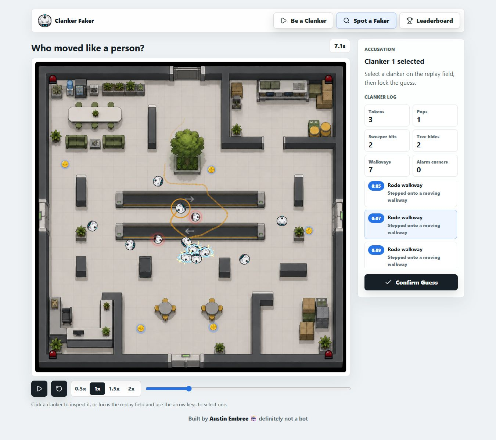

# Clanker Faker

**A browser social deduction game about moving like a bot and spotting the human.**

[Play the game](https://clankerfaker.com/) · [Source code](https://github.com/NitsuaParrhesia/clankerfaker)

## Overview

Clanker Faker turns a short action game into an asynchronous deduction challenge. One player has 35 seconds to collect three tokens and complete a public task while blending in with ten autonomous bots. Another player studies the recorded round and identifies the human.

The project combines a React and TypeScript interface, a custom Canvas 2D game, replay tools, and a Cloudflare Pages Functions backend with D1 persistence.

## Design and engineering

**Bots that leave room for doubt.** A seeded simulation controls routes, collisions, collectibles, alarms, and security sweepers. Bot personalities vary their speed, pauses, and task commitment, giving the human behavior to imitate and the spotter patterns to question.

**Replay as the second half of the game.** Recorded snapshots preserve the round for another player. Interpolated playback, scrubbing, playback speeds, actor trails, and an event log make the replay a tool for investigation. The browser compacts and gzip-compresses replay data before storing it under a short share ID in D1. Self-contained links provide a sharing fallback when storage is unavailable.

**A complete loop across players.** Anonymous local profiles, expiring replay queues, review records, and separate faker and spotter ratings connect the two roles. Duplicate submissions do not score twice, and self-reviews do not affect competitive stats or rankings. A local acceptance regression follows a winning simulated run through replay storage, a second profile's review, and leaderboard updates.

## Finishing the experience

- Shared dialogs handle keyboard focus, Escape dismissal, and focus restoration. Scrollable content and visible action buttons improve the small-screen instructions and replay introductions; a touch joystick supports mobile movement.
- Converting twelve runtime artwork assets to WebP reduced their combined file size by **85.5%**, from **5.49 MB to 798 KB**. The homepage's three main images went from **2.40 MB to 108 KB**. Original artwork is retained, and the conversion script preserves sprite frame geometry.
- The repository includes setup instructions, SQL migrations, type checks, game-logic tests, a local acceptance runner, and continuous integration configuration.

The performance figures compare image file bytes; they are not page-load timing or Core Web Vitals measurements. The game uses browser-local identities and client-generated recordings, appropriate for casual play rather than a verified competitive platform.

## Portfolio card copy

Clanker Faker is an asynchronous social deduction game: blend in with ten bots, then challenge another player to find you in the replay. Built with React, TypeScript, Canvas 2D, and Cloudflare D1, it features a seeded simulation, compressed replay sharing, mobile controls, and separate faker and spotter rankings.

**Stack:** React · TypeScript · Vite · Canvas 2D · Cloudflare Pages Functions · D1 · Vitest
